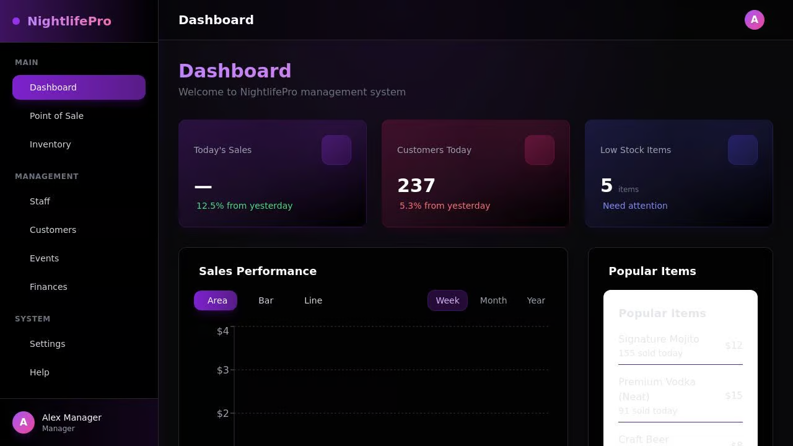

# NightlifePro - Sistem Manajemen untuk Klub Malam dan Bar

NightlifePro adalah sistem manajemen komprehensif yang dirancang khusus untuk industri klub malam dan bar. Aplikasi ini menggabungkan semua aspek penting dari operasi klub/bar dalam satu platform terintegrasi, memungkinkan pemilik dan manajer mengelola bisnis mereka dengan lebih efisien.

## Fitur Utama

### 🌟 Dashboard Interaktif
- Visualisasi data penjualan dengan grafik dinamis (Area, Bar, Line)
- Statistik real-time untuk penjualan, kunjungan pelanggan, dan inventaris
- Akses cepat ke transaksi terbaru dan acara mendatang

### 💰 Manajemen Keuangan
- Pelacakan penjualan dan pendapatan harian, mingguan, dan bulanan
- Laporan pengeluaran dan analisis profitabilitas
- Integrasi dengan sistem pembayaran

### 🥃 Inventaris & Bar
- Manajemen stok minuman dan bahan-bahan
- Peringatan untuk stok rendah
- Pelacakan penggunaan dan pembelian

### 🧑‍🤝‍🧑 Manajemen Staf
- Jadwal shift dan manajemen kehadiran
- Pelacakan kinerja
- Sistem manajemen gaji

### 🎫 Manajemen Acara
- Perencanaan dan jadwal acara
- Promosi dan penjualan tiket
- Daftar tamu VIP

### 👥 Manajemen Pelanggan
- Database pelanggan tetap dan VIP
- Program loyalitas
- Analisis demografi pelanggan

### 💵 Point of Sale (POS)
- Antarmuka kasir yang intuitif
- Pemrosesan pembayaran
- Manajemen diskon dan promosi

## Teknologi

NightlifePro dibangun menggunakan stack teknologi modern:

- **Frontend**: React.js dengan TypeScript, Tailwind CSS, dan Shadcn UI
- **Backend**: Node.js dengan Express
- **Database**: Sistem penyimpanan in-memory (dapat ditingkatkan ke PostgreSQL)
- **Visualisasi**: Recharts untuk grafik dan dashboard
- **State Management**: React Query untuk manajemen state dan caching

## Keamanan

Sistem ini dirancang dengan mempertimbangkan keamanan:

- Otentikasi pengguna berbasis peran
- Enkripsi data sensitif
- Pencatatan aktivitas untuk audit

## Tampilan

Aplikasi ini memiliki desain yang mencerminkan industri klub malam dengan tema gelap elegan dan aksen neon, menciptakan pengalaman visual yang menarik sambil tetap profesional dan fungsional.

## Persyaratan Sistem

- Node.js 18 atau yang lebih baru
- Browser modern (Chrome, Firefox, Safari, Edge)

## Instalasi dan Pengaturan

1. Clone repositori
2. Jalankan `npm install` untuk menginstal dependensi
3. Mulai server pengembangan dengan `npm run dev`
4. Akses aplikasi di `http://localhost:5000`

## Lisensi

© 2025 NightlifePro. Hak Cipta Dilindungi.